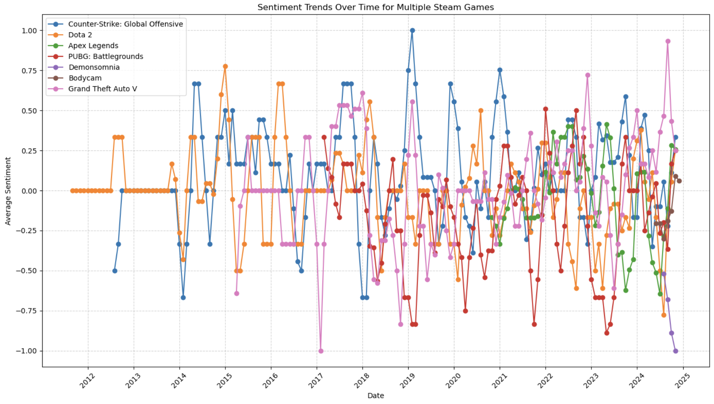
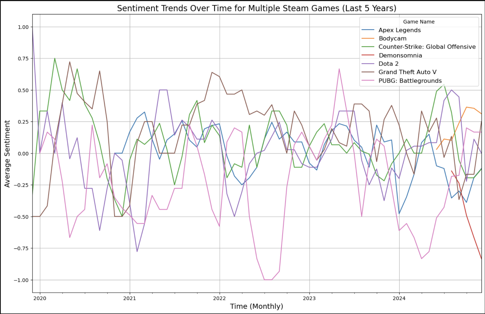

# 🎮 Gaming Applications Sentiment Analysis

## 📖 Project Description
This project analyzes **user reviews** from popular Steam games such as *Counter-Strike: Global Offensive*, *Dota 2*, *Apex Legends*, and others.  
The goal is to uncover **sentiment trends over time** and understand how updates, events, and community dynamics affect player perceptions.

The pipeline combines:
- **Web scraping** with BeautifulSoup/requests (or Selenium if needed)
- **Data preprocessing** with NLTK & pandas
- **Sentiment classification** using TextBlob and Hugging Face Transformers
- **Visualization** with matplotlib

---

## ✨ Features
- 🔎 Automated review collection from Steam pages  
- 🧹 Text cleaning and preprocessing for consistent analysis  
- 🤖 Sentiment scoring (rule-based + transformer-based)  
- 📊 Time-series visualizations showing sentiment trends per game and across multiple titles  

---

## ⚙️ Installation

### Requirements
- Python 3.7+  
- Libraries: `pandas`, `requests`, `beautifulsoup4`, `nltk`, `textblob`, `transformers`, `matplotlib`  
- Jupyter Notebook (if running interactively)

### Setup
Clone the repository and install dependencies:
```bash
git clone https://github.com/yourusername/gaming-sentiment-analysis.git
cd gaming-sentiment-analysis
pip install -r requirements.txt
````

---

## 🚀 Usage

Run the notebook or the script to reproduce results:

### Notebook

```bash
jupyter notebook gaming.ipynb
```

### Script

```bash
python gaming.py
```

Steps performed:

1. Scrape/load reviews
2. Clean and preprocess text
3. Classify sentiment
4. Plot sentiment trends

Outputs include processed datasets (`.csv`) and plots (`.png`) inside `images/`.

---

## 📊 Sample Results

### Long-Term Sentiment Trends

<p align="center">
  
  <br/>
  <em>Sentiment trends over time for multiple Steam games (2012–2025).</em>
</p>

### Recent 5-Year Trends

<p align="center">
  
  <br/>
  <em>Sentiment trends over the last 5 years, showing community responses to recent updates and events.</em>
</p>

---

## ⚠️ Challenges

* Sarcasm and gaming slang reduce model accuracy
* Review bombing or sudden spikes distort sentiment averages
* Currently limited to English-language reviews

---

## 🔮 Future Work

* Train a domain-specific model for gaming reviews
* Real-time sentiment dashboard with Streamlit
* Multi-source integration (Reddit, Twitter, Discord)
* Aspect-based sentiment (gameplay vs. graphics vs. monetization)

---

## 🤝 Contributing

1. Fork the repo
2. Create a branch: `git checkout -b feature/my-feature`
3. Commit your changes
4. Open a Pull Request

---

## 📚 References

* [TextBlob](https://textblob.readthedocs.io/) – rule-based sentiment analysis
* [Hugging Face Transformers](https://huggingface.co/transformers/) – modern deep learning models
* Research papers on gaming sentiment analysis

---

## 📌 License

This project is licensed under the MIT License.
