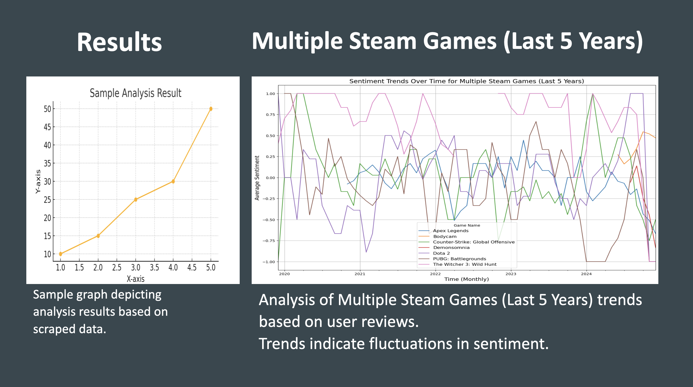
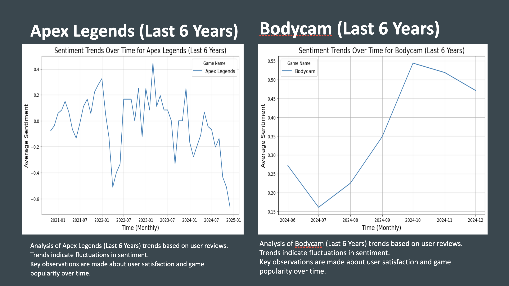
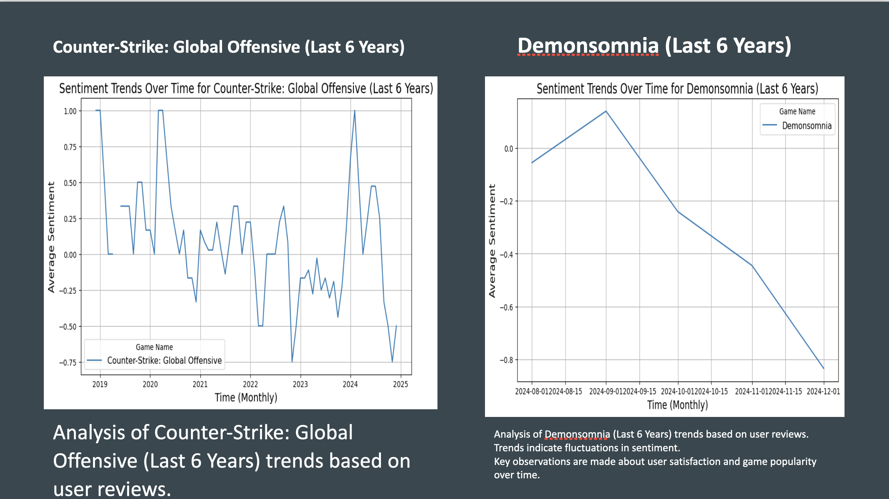
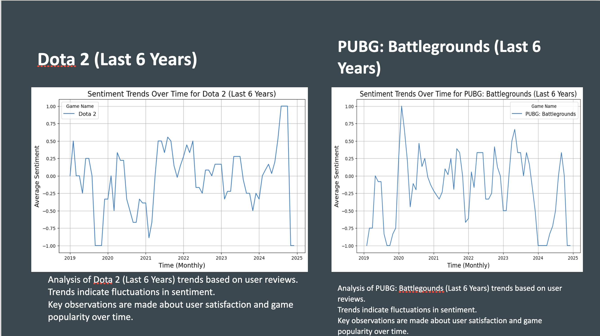
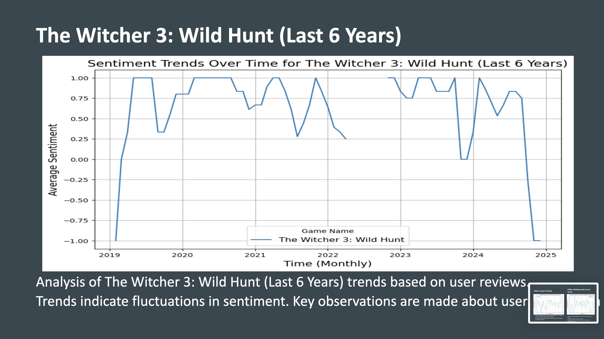

# 🎮 Gaming Applications Sentiment Analysis

## 📖 Project Description
This project analyzes **user reviews** from popular games like *Counter-Strike: Global Offensive*, *Dota 2*, and *Apex Legends* to uncover sentiment trends over time.  

It leverages:
- **Web scraping** for data collection  
- **Text preprocessing** with NLTK  
- **Sentiment analysis** using TextBlob & Hugging Face Transformers  
- **Visualization** with matplotlib  

Everything is implemented in a **Jupyter Notebook** for interactive exploration, making it easy to tweak, rerun, and visualize results step by step.

---

## ✨ Features
- 🔎 Scrapes and collects gaming review data  
- 🧹 Preprocesses messy review text into clean datasets  
- 🤖 Classifies sentiment with:
  - TextBlob polarity scores  
  - Hugging Face Transformers (BERT-based models)  
- 📊 Generates plots showing sentiment trends over time  
- 📝 Interactive workflow in Jupyter Notebook for experimentation  

---

## ⚙️ Installation

### Requirements
- Python 3.7+  
- Jupyter Notebook / JupyterLab  
- Libraries: `pandas`, `requests`, `beautifulsoup4`, `nltk`, `textblob`, `transformers`, `matplotlib`

### Setup
Clone the repository and install dependencies:
```bash
git clone https://github.com/yourusername/gaming-sentiment-analysis.git
cd gaming-sentiment-analysis
pip install -r requirements.txt
````

Launch Jupyter:

```bash
jupyter notebook
```

---

## 🚀 Usage

1. Open the provided notebook:

   ```bash
   jupyter notebook gaming.ipynb
   ```
2. Run all cells (`Kernel > Restart & Run All`)
3. The notebook will:

   * Scrape (or load) review data
   * Clean and preprocess text
   * Run sentiment classification
   * Generate and display trend plots inline

---

## 📊 Sample Results

Example visualization generated by the notebook:

<p align="center">
  
  <br/>
  <em>Average sentiment polarity for CS:GO, Dota 2, and Apex Legends over time.</em>
</p>

<p align="center">
  
  <br/>
  <em>Average sentiment polarity for CS:GO, Dota 2, and Apex Legends over time.</em>
</p>

<p align="center">
  
  <br/>
  <em>Average sentiment polarity for CS:GO, Dota 2, and Apex Legends over time.</em>
</p>

<p align="center">
  
  <br/>
  <em>Average sentiment polarity for CS:GO, Dota 2, and Apex Legends over time.</em>
</p>

<p align="center">
  
  <br/>
  <em>Average sentiment polarity for CS:GO, Dota 2, and Apex Legends over time.</em>
</p>

👉 Save notebook outputs as `.png` in an `images/` folder, then embed them in the README using:

```markdown

```

---

## ⚠️ Challenges

* Sarcasm & gaming slang may confuse models
* Review bombing can cause sudden spikes in sentiment
* Currently focused on English-language reviews

---

## 🔮 Future Work

* Domain-specific model fine-tuning
* Multi-source analysis (Reddit, Twitter, Discord)
* Aspect-based sentiment (graphics, gameplay, updates, etc.)
* Real-time dashboard with Streamlit

---

## 🤝 Contributing

Contributions welcome!

* Fork → Branch → Commit → PR

---

## 📚 References

* [TextBlob](https://textblob.readthedocs.io/)
* [Hugging Face Transformers](https://huggingface.co/transformers/)
* Research papers on sentiment analysis in gaming reviews

---

## 📌 License

This project is licensed under the MIT License.

